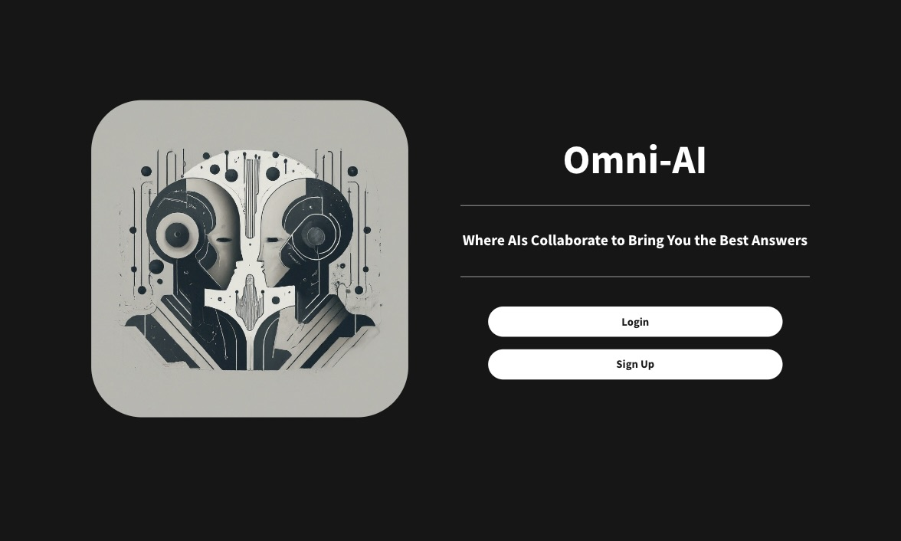
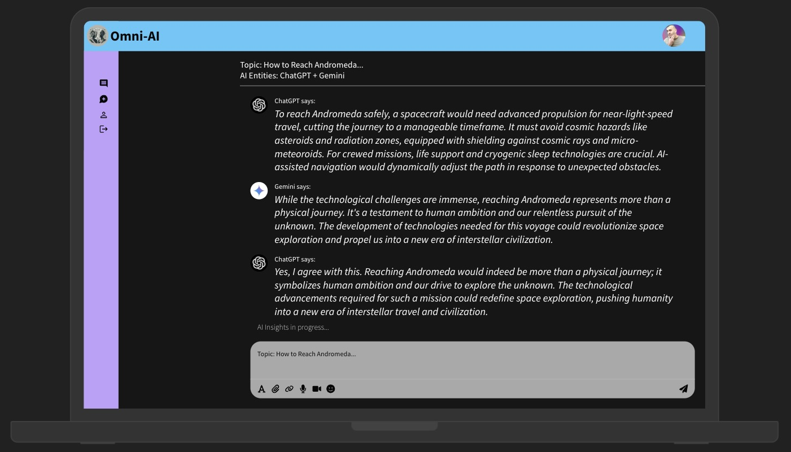

# Omni-AI: AI Integration Platform



## Description

Omni-AI is an AI integration platform that allows users to interact with multiple AI systems, such as OpenAI's ChatGPT and Google's Gemini. This platform provides an innovative way to see how different AI entities collaborate to respond to prompts. It also offers a dynamic interaction model where users can guide the AI's conversation and observe how different AI systems generate responses.

The idea behind this app was to create a tool that would facilitate a more interactive and nuanced conversation with AI by bringing in the perspectives of multiple AI systems, providing a richer and more diverse user experience.

## Getting Started

- **Deployed App:** [https://omni-ai-app-fc082d83eddb.herokuapp.com/login](#)
- **Planning Materials:** [https://trello.com/b/u1LgmzUw/unit-2-project](#)

## Features

- User authentication (signup, login, logout)
- Create, edit, and delete AI conversations
- Real-time interaction between multiple AI entities
- User guidance to influence AI responses

## Screenshot



## Attributions

- **[OpenAI](https://openai.com/)** - Used for the ChatGPT API integration.
- **[Google Cloud](https://cloud.google.com/)** - Used for the Gemini AI API integration.
- **[Google Auth Library](https://www.npmjs.com/package/google-auth-library)** - For Google Cloud service account authentication.
- **[Axios](https://www.npmjs.com/package/axios)** - For making API requests.
- **[bcryptjs](https://www.npmjs.com/package/bcryptjs)** - For password hashing in user authentication.
- **[EJS](https://ejs.co/)** - For rendering views.
- **[Express.js](https://expressjs.com/)** - As the web application framework.
- **[Mongoose](https://mongoosejs.com/)** - For MongoDB object modeling.
- **[dotenv](https://www.npmjs.com/package/dotenv)** - For environment variable management.
- **[Nodemon](https://www.npmjs.com/package/nodemon)** - For development server.

## Technologies Used

- **JavaScript**
- **Node.js**
- **Express.js**
- **MongoDB (Mongoose)**
- **EJS (Embedded JavaScript Templates)**
- **Axios**
- **Google Auth Library**
- **OpenAI API**
- **Google Cloud API (Gemini)**
- **HTML/CSS**

## Next Steps (Stretch Goals)

- **Improved UI/UX:** Enhance the user interface for a more user-friendly experience.
- **AI Conversation Logs:** Display detailed conversation logs for each AI interaction.
- **AI Model Customization:** Allow users to choose specific AI models (e.g., GPT-4) and customize the interaction settings.
- **Multi-Language Support:** Enable AI interactions in multiple languages.
- **AI Summary:** Provide a feature where AI generates a summary of each conversation.
- **Real-time Collaboration:** Allow multiple users to observe and guide the AI interactions in real-time.

## Next Steps for API Requests in `aiController.js`

For the `aiController.js` API requests, below is the code for the next steps:

```javascript
// Download the JSON key file, which contains the credentials needed for API access.

// Google Auth setup for Gemini API
const auth = new GoogleAuth({
    keyFile: GOOGLE_SERVICE_ACCOUNT_PATH,
    scopes: ['https://www.googleapis.com/auth/cloud-platform'],
});

// Helper function to send a request to the ChatGPT API
```
